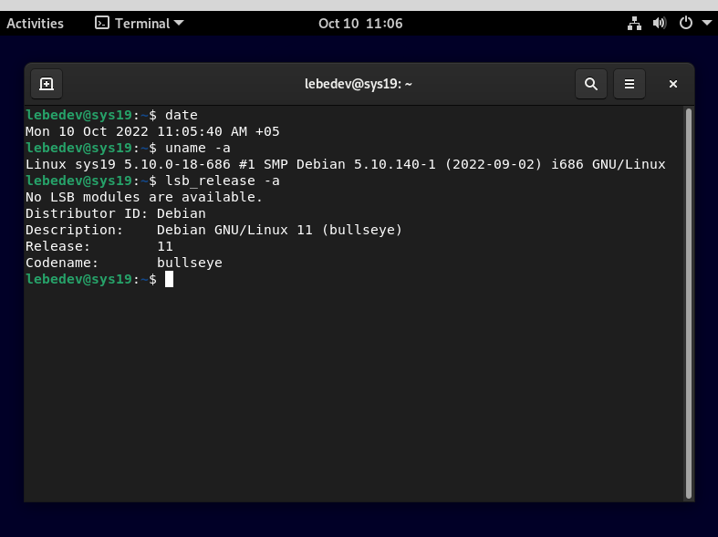
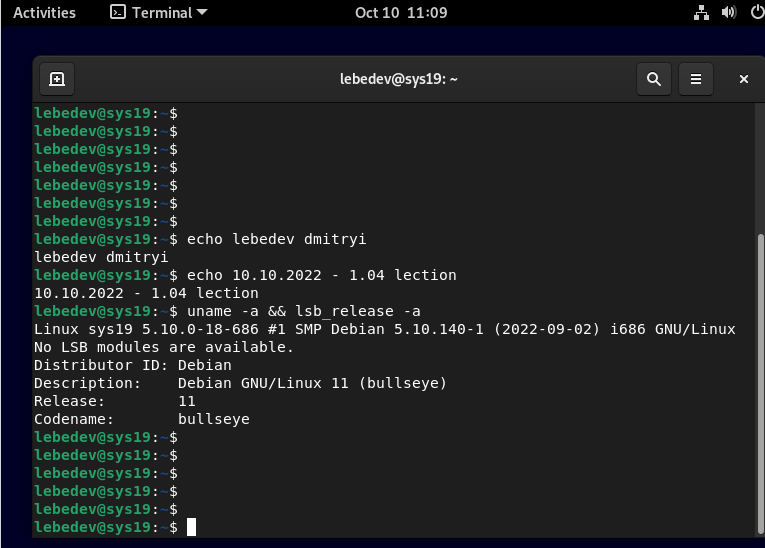
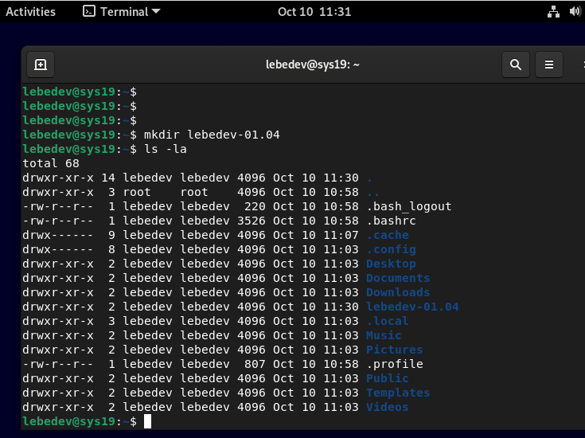
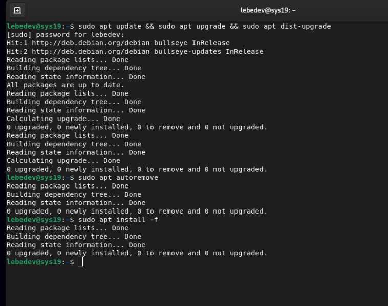
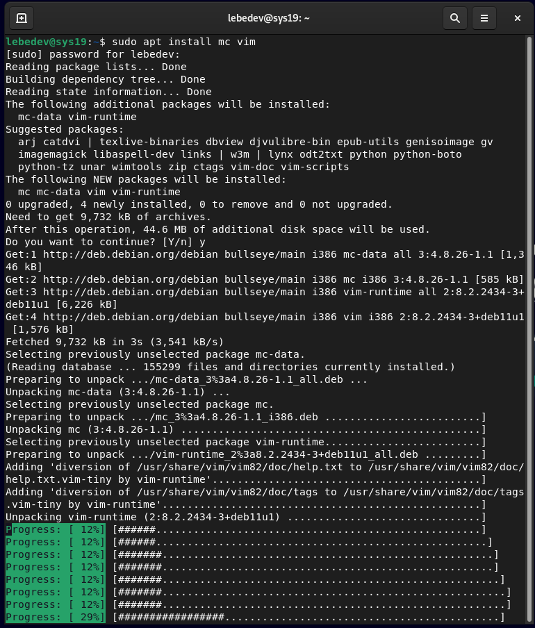
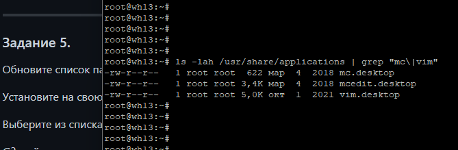
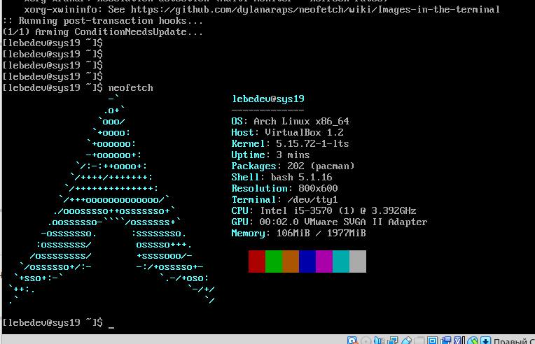

# 01.04. Основы работы с командной строкой - Лебедев Д.С.
## Задание 1
Установка Debian на виртуальную машину

## Задание 2


## Задание 3


## Задание 4
```sh
mv lebedev-01.04 22-10-10_lebedev-01.04 && cd 22-10-10_lebedev-01.04 && touch concept.1 && lsb_release -a >> concept.1 && echo "lebedev dmitriy" >> concept.1 && echo "lection 01.04" >> concept.1 && echo "lebedev dmitriy"
```

## Задание 5




**Часть задания доделываю на домашнем сервере**



## Задание 6*
Установите на виртуальную машину **Arch Linux**
