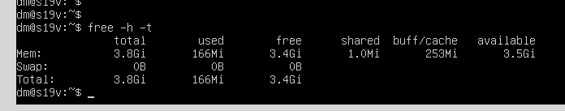
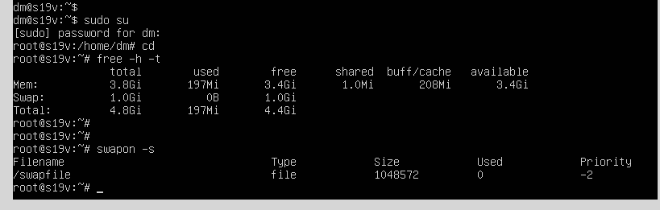
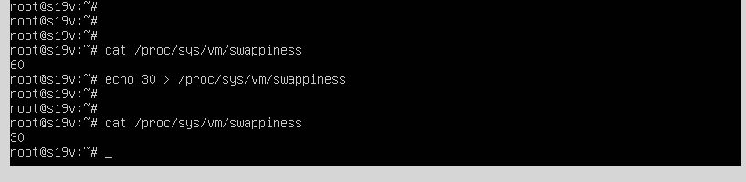
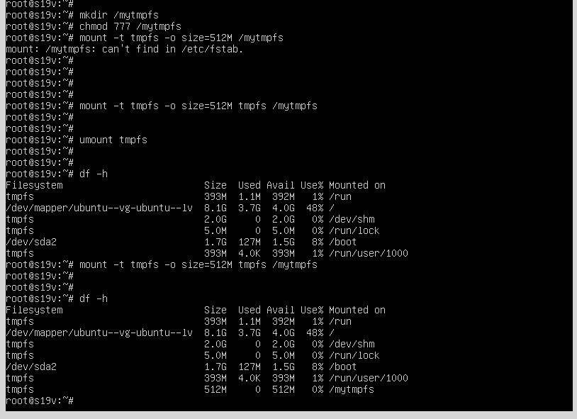

# 02.02. Память, управление памятью - Лебедев Д.С.
## Задание 1
- Во время перехода в ***спящий режим*** данные продолжают храниться в оперативной памяти, система приостанавливает работу;
 - При переходе в ***режим гибернации*** данные оперативной памяти сохраняются на SSD/HDD, система обесточивается.

## Задание 2
`vmstat` - позволяет вывести информацию об использовании памяти, дисков, процессора.   
- **si** (swap in) – количество блоков в секунду, которое система считывает из swap в память;
- **so** (swap out) – количество блоков в секунду, которое система перемещает из памяти в swap.

## Задание 3
1. Вывести архитектуру можно командами `lscpu` или `uname -m`
```bash
dml@dl54:~$ lscpu | grep 'Архитектура'
Архитектура:                     x86_64
```
2.  Посмотреть модель процессора `cat /proc/cpuinfo`:
```bash
dml@dl54:~$ cat /proc/cpuinfo | grep 'model name' | uniq
model name	: Intel(R) Core(TM) i5-8300H CPU @ 2.30GHz
```
3. Информация об оперативной памяти `cat /proc/meminfo`:
```bash
dml@dl54:~$ cat /proc/meminfo | grep 'Inactive'
Inactive:        5312312 kB
Inactive(anon):  2503928 kB
Inactive(file):  2808384 kB
```

## Задание 4
[SWAP — как создать, подключить, очистить и отключить файл подкачки в Linux](https://sheensay.ru/swap)  
[Параметр vm.swappiness](https://help.ubuntu.ru/wiki/swap#%D0%BF%D0%B0%D1%80%D0%B0%D0%BC%D0%B5%D1%82%D1%80_vmswappiness)

1. 
4.  
6. 

## Задание 5*
tmpfs используется, когда нужно работать с большим количеством мелких файлов или некоторое время хранить объемные данные и делать это по возможности быстро, без завязок на медленную файловую подсистему и/или диски. Например, для работы с логами в рамках сеанса, для хранения временных файлов.  
Возможно использование с целью снизить износ постоянного хранилища, это актуально при установке ОС на SD карту, например, в микрокомпьютерах.  
Я использую данную технологию при загрузке [PuppyRus Linux](https://ru.wikipedia.org/wiki/PuppyRus_Linux) с флешки. После загрузки вся ОС находится полностью в RAM. Если не ошибаюсь, при этом как раз используется tmpfs.

