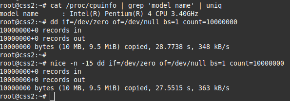
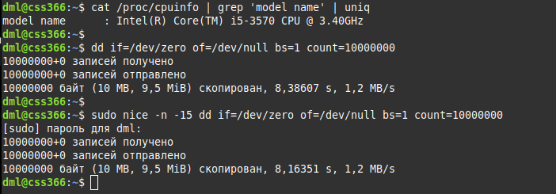
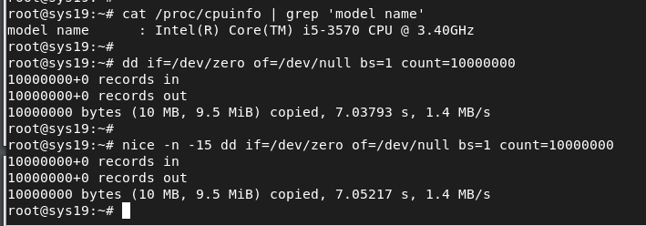
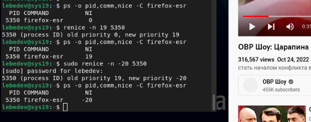

# 02.03. Шедулер - Лебедев Д.С.
## Задание 1
*Какие операции замедляют работу компьютера в многозадачных системах?*  

**Ответ**  
Замедляют работу процессора (следовательно, всей системы) операции с частой сменой контекста и большим количеством обращений CPU к оперативной памяти. Переключение контекста является очень ресурсоёмкой операцией, причем чем больше ядер у процессора, тем более ресурсоёмкой эта операция становится.

## Задание 2
*В каких ситуациях планировщик ввода / вывода noop может быть производительней cfq?*

**Ответ**  
Преимущества noop возможны при работе с устройствами хранения, которые сами оптимизируют операции ввода-вывода, например, внешний RAID-массив, SSD диски, USB накопители. Причина - в простоте данного планировщика, использование минимального количества инструкций процессора на операции I/O, отсутствуют сложные алгоритмы.

## Задание 3*
Запустите следующий код, имитирующий нагрузку типа ввод / вывод, с разными приоритетами. Объясните получившееся различие во времени исполнения для разных запусков.
```Bash
dd if=/dev/zero of=/dev/null bs=1 count=10000000
```

**Ответ**  
Тесты проводились в трёх системах с разным количеством ядер процессора.

1. Pentium 4, 2 ядра  


2. i5, 4 ядра  


3. Виртуальная машина, i5, одно ядро  


Наиболее показательным получился первый результат с CPU P4, при увеличении приоритета (уменьшении показателя отзывчивости) операция прошла на секунду быстрее.
Физический смысл - планировщик предоставил процессу больше циклов процессора, и его выполнение заняло меньше времени, за счет других задач.

## Задание 4*
При каких условиях лучше увеличить time slice планирования, а когда лучше уменьшить?

**Ответ**  
time slice - размер кванта времени, выделяемого за раз. Изменение этого значения позволяет найти компромисс между отзывчивостью системы и количеством смен контекста (КПД CPU).  
При увеличении снижается отзывчивость системы, но операции ввода вывода ускоряются (меньше прерываний). Необходимо учитывать, что это влияет на все процессы в системе.  
**Вывод** - если система используется для пользовательских программ (видео, редакторы и т.п. число-дробилки), возможно, стоит уменьшить значение показателя. При увеличении time slice возможна оптимизация программ ввода/вывода (запись на диск, работа с сетью, например).

## Задание 5*
Запустите веб-браузер с разными приоритетами. Создайте условия, чтобы получить различную отзывчивость браузера при использовании разных приоритетов. Запишите условия и опишите результаты.

**Ответ**  
**Начальные условия:**  
- Запуск Firefox с приоритетом 0;
- Узнаю PID и приоритет `ps -o pid,comm,nice -C firefox-esr`
- Запуск большого копирования `dd if=/dev/zero of=/dev/null bs=1 count=100000000`
- Запуск просмотра видео на youtube;
- Меняю приоритет браузера `nice -n -20, nice -n 19`

**Описание результата:**  
При самом высоком приоритете (-20) видео проигрывается, хотя с низким качеством. При самом низком значении приоритета (19) видео не загружается, сам браузер перестаёт реагировать и зависает.
