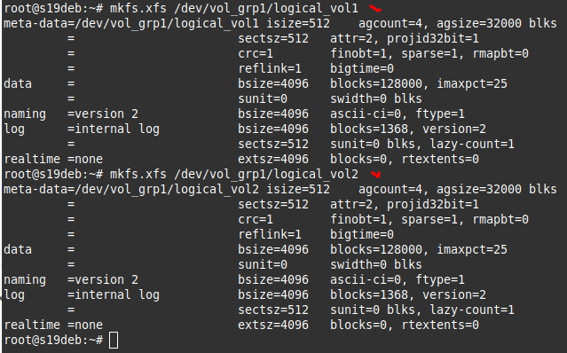

# 02.04. Дисковые системы - Лебедев Д.С.
## Задание 1
*Какие виды RAID увеличивают производительность дисковой системы?
Приведите ответ в свободной форме.*

**Ответ**  
RAID 0 - массив дисков с чередованием данных. При использовании RAID 0 блоки данных записываются по очереди на каждый диск, что существенно увеличивает производительность операций чтения и записи. Отличается самой низкой надежностью хранения данных.
RAID 10 - массив дисков с зеркалированием и чередованием. Представляет собой массив RAID 0 из нескольких массивов RAID 1. RAID 10 обладает самой высокой производительностью и надежностью, при этом эффективность использования дискового пространства составляет 50%.

## Задание 2
*Влияет ли количество операций ввода-вывода на параметр `load average`? Приведите развернутый ответ в свободной форме.*

**Ответ**  
Средние значения нагрузки (Load averages) - метрика отслеживания средней нагрузки на Linux. Смысл - отношение числа процессов, которым требуются вычислительные ресурсы системы к имеющимся в наличии ресурсам.  
Средние значения нагрузок могут увеличиваться из-за дисковой (или NFS) нагрузки ввода/вывода, а не только ресурсов процессора, поэтому количество операций **влияет** на этот параметр.

## Задание 3
*Подключите к виртуальной машине 2 новых диска.*  

1) *На первом диске создайте таблицу разделов MBR, создайте 4 раздела: первый раздел на 50% диска, остальные любого размера на ваше усмотрение. Хотя бы один из разделов должен быть логическим.*  
2) *На втором диске создайте таблицу разделов GPT. Создайте 4 раздела: первый раздел на 50% диска, остальные любого размера на ваше усмотрение.*  

## Задание 4*
*Создайте программный RAID 1 в вашей ОС используя программу mdadm. 
Демонстрация работы утилиты была на лекции. Объем RAID неважен. В качестве ответа приложите скриншот вывода команды mdadm -D /dev/md0, где md0 - это название вашего рейд массива(может быть любым).*

## Задание 5*
Сделайте скриншоты вывода команд df -h, pvs, lvs, vgs;  

1. подключите к ОС 2 новых диска;  

2. создайте новую VG, добавьте в него 1 диск;  

3. создайте 2 LV, распределите доступное пространство между ними поровну;  

4. создайте на обоих томах файловую систему xfs;  

5. создайте две точки монтирования и смонтируйте каждый из томов;
6. сделайте скриншот вывода команд df -h;  

7. добавьте в VG второй оставшийся диск;  

8. расширьте первый LV на объем нового диска;  

9. расширьте файловую систему на размер нового доступного пространства;  

10. сделайте скриншоты вывода команд df -h, pvs, lvs, vgs.  
