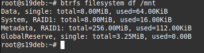

# 02.05. Файловые системы - Лебедев Д.С.
### Задание 1
-  Создайте каталог ~/test и в нем файл test_123 с любым содержимым.
```bash
 mkdir ~/test && ps aux > ~/test/test_123
```

-   Создайте символическую ссылку на каталог ~/test по такому пути: /tmp/soft_link.
```bash
ln -s ~/test /tmp/soft_link
```

-   Используя ссылку /tmp/soft_link копируйте файл test_123 в каталог /tmp с тем же именем. Создайте жесткую ссылку на файл /tmp/test_123 с именем /tmp/hard_link.
```bash
cp /tmp/soft_link/test_123 /tmp && ln /tmp/test_123 /tmp/hard_link
```

_Вопрос 1: Файл ~/test и /tmp/test_123 это один и тот же файл(одинаковые inode)?_  
*Ответ:* `stat ~/test && stat /tmp/test_123`    
Это **не** одинаковые файлы и inode у них разные. Объект ~/test является каталогом (directory), а /tmp/test_123 - файлом (regular file)

_Вопрос 2: Файл /tmp/soft_link и /tmp/hard_link это один и тот же файл(одинаковые inode)?_  
*Ответ:* `stat /tmp/soft_link && stat /tmp/hard_link`  
Это **не** одинаковые файлы и inode у них разные. Объект /tmp/soft_link является символической ссылкой на каталог ~/test (symbolic link), а /tmp/hard_link - файлом (regular file)

_Вопрос 3: Файл /tmp/test_123 и /tmp/hard_link это один и тот же файл(одинаковые inode)?_  
*Ответ:* `stat /tmp/test_123 && stat /tmp/hard_link`  
/tmp/hard_link - жесткая ссылка на /tmp/test_123, поэтому inode одинаковые. Жесткие ссылки – это ссылки, которые отражают или копируют исходный файл. Жесткие ссылки имеют одинаковые номера inode. Фактически, при создании жесткой ссылки файлу добавляется ещё одно имя.

_Вопрос 4: Докажите что одна из ссылок символическая, а другая жесткая. Обязательно приложите в ответ скриншоты команд, которые иллюстрируют различия ссылок разного типа или(если не уверены) ход решения задания._  
*Ответ:* `stat /tmp/soft_link && stat /tmp/hard_link`  


### Задание 2
-   Создайте файл `~/netology`.
-   Создайте каталог `~/netology/`.
-   Поместите файл `netology` в каталог `netology`.

_Какое(ие) из трех действий выполнить невозможно? Почему?_  
*Ответ:*  
Получим ошибку `cannot create directory ‘netology’: File exists` уже на втором шаге, т.к. каталоги в Linux также рассматриваются как файлы. Каталог - это специальный файл, который сопоставляет имя файла с его номером индекса, по этой причине не может содержать два файла с одинаковым именем, и не может отображать одно имя с двумя разными номерами инодов.

### Задание 3
-   Как посмотреть количество `inodes`?
-   В каких файловых системах не может возникнуть проблемы нехватки `inodes`?

_Приведите ответ в свободной форме._

*Ответ:*  
Количество inodes можно посмотреть командой `df -i`  


Нет проблем с количеством inodes в ФС, где они генерируются динамически по мере необходимости. Например, jfs, xfs, btrfs, zfs.

### Задание 4
В задании не предполагается использование LVM.
-   Подключите к системе новый диск 3ГБ.
-   Создайте на нем один раздел размером 2 ГБ.
-   Разметьте раздел как `xfs`.
-   Смонтируйте раздел по пути /mnt. Создайте любой файл на смонтированной файловой системе. Выполните скриншот вывода команды "df -hT".  

-   Увеличьте раздел до 3 ГБ.
-   Расширьте файловую систему на новое свободное пространство.  

-   Убедитесь что созданный вами файл остался внутри раздела и файловой системы после всех манипуляций.
-   Выполните скриншот вывода команды "df -hT".  
  
[Помогла статья](https://serveradmin.ru/rasshirenie-uvelichenie-xfs-kornevogo-razdela-bez-ostanovki/)

### Задание 5*
Создайте файловую систему `Btrfs` на двух дисках размером 5Гб каждый.
```bash
apt install btrfs-progs
mkfs.btrfs /dev/sdb /dev/sdc
btrfs filesystem show
mount /dev/sdb /mnt
btrfs filesystem df /mnt
```



_Сколько будет доступно места для работы с файлами? Сколько займут метаданные?_
*Ответ:* 
Создание btrfs на нескольких дисках сразу по умолчанию применит профиль «RAID0» к пользовательским данным, а к метаданным — «RAID1». Поэтому для работы с файлами **доступно 10 Гб минус метаданные и системный резерв**.  
В первой строке пишутся совокупные объёмы выделенного и занятого места. 
- «Single» означает, что Btrfs используется на одиночном накопителе. 
- «Total» показывает, сколько места доступно, причём оно может быть намного меньше общего количества места на накопителе (Btrfs выделяет место порциями).
- «Used» показывает, сколько места на файловой системе реально занято.
Вторая строка отображает, сколько места занято под системный резерв.  
Третья строка показывает, сколько занимает дерево метаданных. На скриншоте видно, что под дерево выделено 256 Мб, из которых заняты около 112 Кб.  
В четвёртой строчке показана информация о резервной области, но уже относящейся к самой Btrfs. Она нужна для того, чтобы даже на полностью забитой ФС можно было удалять и создавать тома и снапшоты.  
Таким образом, чтобы узнать, сколько места реально занято на Btrfs, нужно смотреть на показатель «used» в первой строчке.
