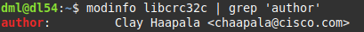
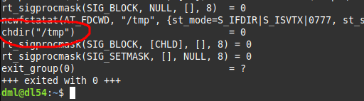
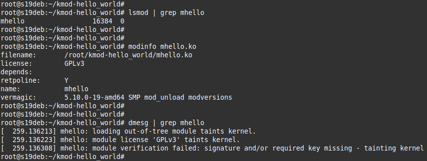

# 02.06. Ядро операционной системы - Лебедев Д.С.
### Задание 1
>При каких событиях выполнение процесса переходит в режим ядра?
>Приведите ответ в свободной форме.

*Ответ:*  
Выполнение процесса переходит под контроль ядра ОС в случае системных вызовов и аппаратных прерываний.  
Системные вызовы передают управление ядру операционной системы, которое определяет, предоставлять ли приложению запрашиваемые ресурсы. Если ресурсы доступны, то ядро выполняет запрошенное действие, затем возвращает управление приложению.  
Аппаратные прерывания - сигналы от аппаратных (например, периферийных) устройств. Работа ядра может быть прервана в любой момент для того, чтобы обработать прерывания. Прерывания могут произойти в любой произвольный момент: сигнал от таймера, сетевой карты или дискового накопителя, нажатие клавиш клавиатуры, движение мыши.

### Задание 2
>Найдите имя автора модуля libcrc32c.
>В качестве ответа приложите скриншот вывода команды.

*Ответ:*  
```bash
modinfo libcrc32c | grep 'author'
```



### Задание 3
>Используя утилиту strace выясните какой системный вызов использует команда cd.
>Примечание: она не является внешним файлом, но для наших целей можно схитрить: strace bash -c 'cd /tmp'.
>В качестве ответа напишите название системного вызова.

*Ответ:*  
В этом случае системный вызов команды cd - это `chdir("/tmp")`  


### Задание 4*
>Соберите свой модуль и загрузите его в ядро.
>В качестве ответа приложите скриншот вывода установки модуля в `dmesg`.

*Ответ:*  
