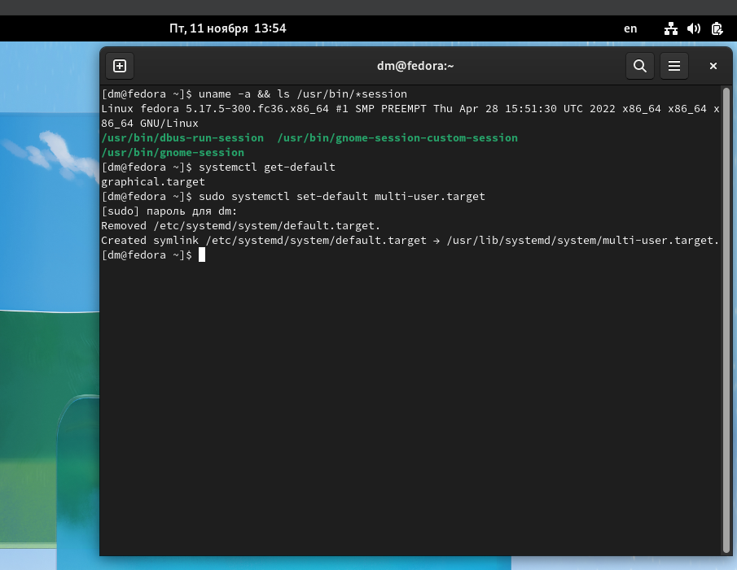
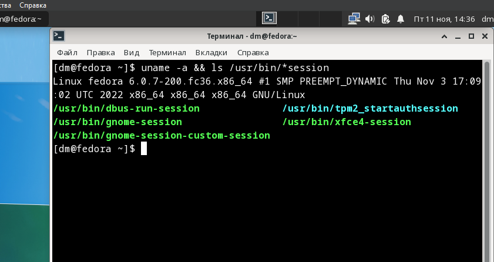

# 03.01. Типы дистрибутивов
### Задание 1.
>Что такое дистрибутив? Какие компоненты могут входить в поставку дистрибутива?

*Ответ:*  
Дистрибутив - форма распространения программного обеспечения, установочный пакет для развёртывания операционной системы. Обычно содержит программы для начальной инициализации системы.  
Дистрибутив Linux в общем случае может состоять из ядра Linux, утилит GNU, дополнительного ПО и диспетчера пакетов. Он также может включать в себя пакет для установки дисплейного сервера и развёртывания среды рабочего стола.

### Задание 2.
>Какую роль в появлении Linux сыграл Таненбаум?

*Ответ:*  
Эндрю Таненбаум разработал UNIX-подобную систему MINIX, которая фактически является предшественником Linux. Изначально именно в MINIX Линус Торвальдс начал добавлять новые функции и адаптировать его к своим потребностям, что явилось предпосылкой к созданию ядра Linux.  
Таненбаум является автором множества книг (которые были переведены на более чем 20 языков), принимал участие в разработке большого количества проектов ПО с открытым исходным кодом.

### Задание 3.
#### 3.1
>yum install mc  
>apt install mc  
>Как получить информацию из какого репозитория был установлен пакет?

*Ответ:*  
RPM (Fedora)
```bash
yum info mc
```

DEB (Debian)
```bash
apt-cache policy mc
```

#### 3.2
>Какой командой можно получить список доступных репозиториев в RPM и Deb- based системах? Два ответа для каждой из систем.

*Ответ:*  
RPM (Fedora)
```bash
yum repolist
ll /etc/yum.repos.d/
```

DEB (Debian)
```bash
apt-cache policy
grep -rhE ^deb /etc/apt/sources.list*
```


#### 3.3
>Как узнать версию ОС в Linux? Как узнать версию ядра? Укажите для вашей системы, неважно какой.

*Ответ:*  
Debian
```bash
lsb_release -a
uname -a
```

#### 3.4
>Как узнать какая система инициализации используется в Linux? Укажите для вашей системы, неважно какой.

*Ответ:*  
Если вспомнить, что PID=1, то
Debian
```bash
ls -l /proc/1/exe
```

#### 3.5*
Работайте на любом RPM или Deb- based Linux:
1. отключите автоматическую загрузку графической оболочки;
2. установите графическую оболочку, которой у вас нет в системе. Например, Mate, Xfce, Openbox;
3. включите автоматическую загрузку графической оболочки;
4. загрузитесь в новую графическую оболочку.  
Приложите скриншоты вашего старого и нового рабочих столов.  
Верните настройки к предыдущим значениям.

Fedora 36
```bash
uname -a && ls /usr/bin/*session
systemctl get-default

sudo systemctl set-default multi-user.target
sudo reboot

sudo dnf install @xfce-desktop-environment
sudo systemctl set-default graphical.target
```

Gnome  


XFCE  
