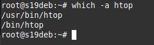

# 03.02. Управление пакетами - Лебедев Д.С.
### Кейс 1.
>Опишите плюсы работы с пакетным менеджером и репозиторием. Как вы считаете, в чем основные достоинства такой организации ПО? Есть ли минусы? Напишите ответ в свободной форме.

*Ответ:*  
Основное достоинство данного подхода - простота использования. В общем случае не нужно искать приложение, следить за версиями. Можно быть уверенным, что приложение из надежного репозитория "чистое" и рабочее. Благодаря менеджеру пакетов решается вопрос с зависимостями. Удобный механизм обновления приложений, с гибкой настройкой.  
Минус - теоретически, возможна подмена пакета в репозитории на "зловредный", и в этом случае масштабы проблемы могут быть значительны.

### Кейс 2.
>При подключении стороннего репозитория надо выполнить ряд определенных действий. Каких? В чем опасность такого способа распространения ПО? Как это решается? Напишите ответ в свободной форме.

*Ответ:*  
Для подключения стороннего репозитория нужно:  
- загрузить и импортировать в систему ключ репозитория;
- добавить репозиторий в `source.list` для сторонних репозиториев;
- обновить списки пакетов.  
Сторонние репозитории бывают разными. Есть, например, репозитории ppa (персональные). При их использовании существует опасность негативного влияния содержащегося там ПО на стабильность, надежность и безопасность системы.  
Решить это можно, **не** используя лишние и сторонние репозитории, использовать только доверенные и стабильные.

### Кейс 3.
>Найдите в репозиториях и установите одной командой пакет htop. Какие зависимости требует htop? Ответ приведите в виде текста команды, которой вы это выполнили, а также приложите скриншот места расположения исполняемых файлов установленного ПО.

*Ответ:*  
Найти и установить (одной командой)  
```bash
apt search htop && apt install htop
```

Для просмотра зависимостей пакета можно воспользоваться командой `apt show`, в секции Depends они перечислены.  
Место расположения исполняемых файлов можно узнать командой `which`:  


### Кейс 4.
>Подключите репозиторий PHP и установите PHP 8.0. Приложите скриншот содержимого файла, в котором записан адрес репозитория. При помощи команды php -v убедитесь, что бы поставлена корректная версия PHP. Приложите к ответу скриншот версии.

*Ответ:*  
```bash
apt install apt-transport-https lsb-release ca-certificates wget -y  
wget -O /etc/apt/trusted.gpg.d/php.gpg https://packages.sury.org/php/apt.gpg  
sh -c 'echo "deb https://packages.sury.org/php/ $(lsb_release -sc) main" > /etc/apt/sources.list.d/php.list'  
apt update  
apt install php8.0-common php8.0-cli
php -v
```


### Кейс 5.
>Ваш коллега-программист просит вас установить модуль google-api-python-client на сервер, который необходим для программы, работающей с Google API. Установите данный пакет при помощи менеджера пакетов pip.  
>Примечание №1: для установки может быть необходим пакет python-distutils, проверьте его наличие в системе.  
>Примечание №2: не забудьте выдать права на исполнение скачанному файлу. Возможно, будет ошибка при установке при помощи Python версии 2, в таком случае воспользуйтесь командой python3.  
>Приложите скриншоты с установленным пакетом python-distutils, с версией Pip и установленными модулями (должны быть видимы)

*Ответ:*  
Для debian 11 выглядит так:
```bash
python3 -V
apt install -y python3-pip python-is-python3
wget https://bootstrap.pypa.io/get-pip.pychmod | python
chmod u+x get-pip.py
./get-pip.py
pip install google-api-python-client
apt show python3-distutils
pip -V
pip list
```


### Кейс 6*.
>Перечислите менеджеры пакетов, кроме тех, о которых говорилось на лекции. В каких дистрибутивах они работают? Есть ли альтернативные менеджеры для тех, которые разбирались на лекции? Напишите ответ в свободной форме.

*Ответ:*  
- DPKG - система управления пакетами в Debian и дистрибутивах на его основе. Низкоуровневый пакетный менеджер создан только для работы с локальными DEB пакетами и не может самостоятельно разрешать зависимости, а также скачивать пакеты из репозиториев.
- RPM - низкоуровневый пакетный менеджер систем RED HAT (RHEL, CentOS, Fedora и др.). Способен работать только с локальными файлами.
- DNF - модифицированная версия пакетного менеджера YUM на языке на Python.
- Pacman – высокоуровневый пакетный менеджер системы Arch Linux и его родственных дистрибутивов.
- Portage – система управления пакетами Gentoo.  
Так же существует множество утилит - надстроек над основными пакетными менеджерами (aptitude, synaptic, pamac). Есть с графическим интерфейсом.  
Можно еще упомянуть активно развиваемые snap и flatpack, которые позволяют создавать дистрибутивно-независимые программные продукты.

### Кейс 7*.
>Скачайте исходники любого приложения и соберите пакет для того дистрибутива, на котором вы работаете. Установите его при помощи менеджера пакетов. Ответ приведите в виде скриншота.

*Ответ:*  
На примере speedtest-cli:  
```bash
apt install dpkg-dev
apt source speedtest-cli
ls speedtest-cli-2.1.3/
apt build-dep speedtest-cli
cd speedtest-cli-2.1.3
dpkg-buildpackage -rfakeroot -b -uc -us
dpkg -i speedtest-cli_2.1.3-2_all.deb
```


[Источник](https://andreyex.ru/debian/kak-sobrat-pakety-debian-iz-ishodnogo-koda/)