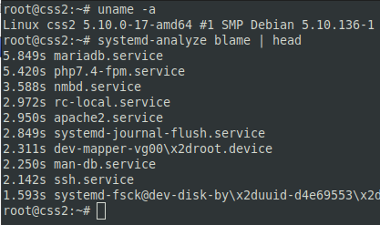

# 03.03. Инициализация системы. Systemd, init-v - Лебедев Д.С.
### Задание 1.
>Выполните systemd-analyze blame. Укажите, какие модули загружаются дольше всего.

*Ответ:*  
Так как список процессов может быть довольно большим, существует возможность отсортировать вывод при помощи команды head (обычно первых 10 записей достаточно).
`systemd-analyze blame | head`  
На веб-сервере дольше всего загружались модули сервера БД и PHP:  


Ситуация на рабочей машине: долгое время показал модуль `plocate-updatedb`. Подозреваю, что это индексация ФС при запуске.  


### Задание 2.
>Какой командой вы посмотрите ошибки ядра, произошедшие начиная со вчерашнего дня? Напишите ответ в свободной форме.

*Ответ:*  
Можно использовать `journalctl` с параметрами:
```sh
journalctl -ek --since=yesterday --until=now | grep ERROR
```


### Задание 3.
>Запустите команду loginctl user-status. Что выполняет, для чего предназначена эта утилита?

*Ответ:*  
Утилита loginctl, входящая в состав systemd, позволяет получать информацию о том, какие пользователи находятся в системе в данный момент, как давно они вошли, какой uid им принадлежит, сколько сеансов запущено на данный момент и т. д. Так же loginctl позволяет управлять сеансами пользователей.  
Опция user-status выводит последние несколько строчек из лога, ассоциированном с текущим пользователем (в данном случае). Выводится статус, какие процессы запущены, какие команды выполнялись.  


### Задание 4.
>Есть ли у вас на машине службы, которые не смогли запуститься? Как вы это определили? Приведите ответ в свободной форме.

*Ответ:*  
Для просмотра всех служб используется юнит `.service` в `systemctl`.  
```sh
systemctl --all -t service
или
systemctl list-units --type service --all
```
В моём случае нет служб, которые не смогли запуститься. Есть not-found сервисы, которых нет в системе, но systemctl знает о них (упоминаются в юнитах).

### Задание 5*.
>Можно ли с помощью systemd отмонтировать раздел/устройство? Приведите ответ в свободной форме.

*Ответ:*  
Если с монтированием ресурсов через  `systemd` проблем не возникает, то размонтирование без перезагрузки невозможно, насколько я понял, перечитав кучу форумов.  
Это связано с тем, что:  
```
Systemd-mount позиционируется не как замена традиционной системной команды mount, а как специфичная для systemd надстройка для манипуляций точками монтирования и автомонтирования на уровне генерации unit-файлов, что позволяет интегрировать операции монтирования в цепочку зависимостей systemd. При этом сами операции монтирования по-прежнему выполняются через вызов утилиты mount из пакета util-linux. Т.е. по сути systemd-mount выполняет задачи создания unit-файлов и их передачи планировщику заданий.
```

man systemd.moumt:
```
Some file systems have special semantics as API file systems for kernel-to-userspace and userspace-to-userspace interfaces. Some of them may not be changed via mount units, and cannot be disabled. For a longer discussion see API File Systems.
```
