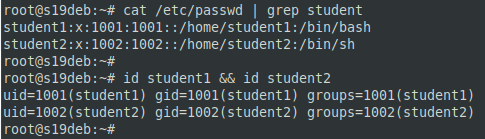
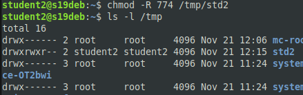
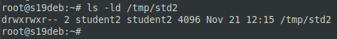
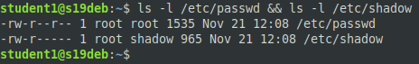
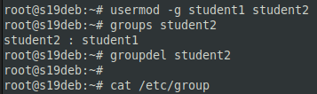
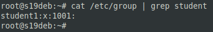
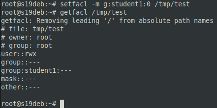
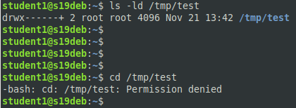

# 03.04. Управление пользователями - Лебедев Д.С.
### Задание 1.
>Создайте пользователя student1 с оболочкой bash, входящего в группу student1. Создайте пользователя student2, входящего в группу student2. Приведите ответ в виде снимков экрана.

*Ответ:*  
```bash
useradd -m -s /bin/bash student1
useradd -m student2
...
cat /etc/passwd | grep student
id student1 && id student2
```



### Задание 2.
>Создайте в общем каталоге (например, /tmp) директорию и назначьте для неё полный доступ со стороны группы student2 и доступ на чтение всем остальным. Приведите ответ в виде снимков экрана.

*Ответ:*  
```bash
su - student2
bash
mkdir /tmp/std2
chmod -R 774 /tmp/std2
ls -l /tmp
ls -ld /tmp/std2
```





### Задание 3.
>Какой режим доступа установлен для файлов /etc/passwd и /etc/shadow? Объясните, зачем понадобилось именно два файла? Приведите ответ в свободной форме.

*Ответ:*  
```bash
ls -l /etc/passwd && ls -l /etc/shadow
```



Файл /etc/passwd содержит список пользователей, которые известны системе. В процессе регистрации пользователя система обращается к 
этому файлу в поисках идентификатора пользователя и его домашнего каталога. Файл доступен для чтения любым пользователем.  
Файл /etc/shadow доступен для чтения только пользователю root и предназначен для хранения зашифрованных паролей. В нем также 
содержится учетная информация, которая отсутствует в файле /etc/passwd.  Файл etc/shadow доступен для чтения только учетной записи root.  
Появление теневого файла (shadow) произошло из-за необходимости отделить зашифрованные пароли от файла /etc/passwd. Идея в том, чтобы сделать файл /etc/passwd доступным для чтения всем пользователям, не сохраняя в нем зашифрованные пароли, а затем сделать /etc/shadow файл доступен для чтения только root или другим привилегированным программам, которым требуется доступ к этой информации. Примером такой программы может быть программа входа в систему.

### Задание 4.
>Удалите группу student2, а пользователя student2 добавьте в группу student1. Приведите ответ в виде снимков экрана.

*Ответ:*  
```bash
groups student2
usermod -g student1 student2
groupdel student2
```





### Задание 5*.
>Создайте в общем каталоге (например, /tmp) директорию и назначьте для неё полный доступ для всех, кроме группы student1. Группа student1 не должна иметь доступа к содержимому этого каталога. Приведите ответ в виде снимков экрана.

*Ответ:*  
Для реализации сложных структур прав доступа используются расширенные права - ACL (Access control list - списки контроля доступа). ACL дают большую гибкость, чем стандартный набор полномочий.

```bash
mkdir /tmp/test
ls -ld /tmp/test
chmod -R 777 /tmp/test
...
apt install acl -y
getfacl /tmp/test
setfacl -m g:student1:0 /tmp/test
```



