# 03.05. Производительность системы - Лебедев Д.С.
### Задание 1.
>Выполните проверку системы при помощи команды top. Выведите сортировку процессов по:
>- памяти;
>- времени работы;
>- номеру;
>- уровню потребления ресурсов.
>
>Приведите ответ в виде снимков экрана.

*Ответ:*  
```bash
top -o %MEM
top -o TIME+
top -o PID
top -o %CPU
```

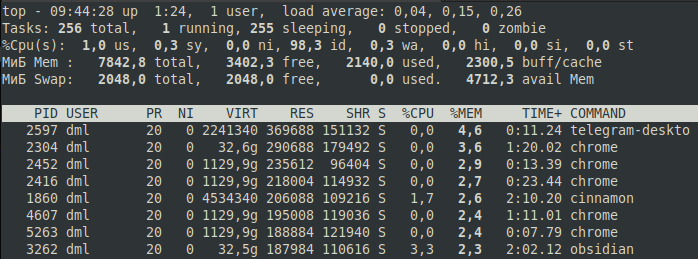

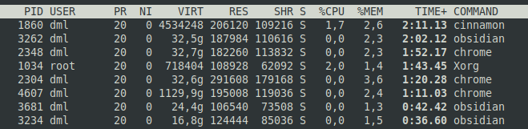

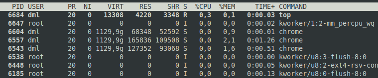

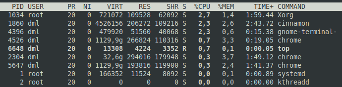

### Задание 2.
>Выполните проверку системы при помощи команды atop и atopsar. Выведите сортировку процессов по:
>- общей нагрузке (минимум по трем параметрам);
>- загруженности HDD or SSD за указанный временной отрезок (10 минут);
>- загруженности RAM за указанный временной отрезок (10 минут).
>
>Сконфигурировать файл настроек atop - делать снимок памяти каждые пол часа. Приведите ответ в виде снимков экрана.

*Ответ:*  
```bash
apt install atop
ls -l /var/log/atop
atopsar -r /var/log/atop/atop_20221124
...
nano /etc/default/atop --> LOGINTERVAL=60
systemctl restart atop
...
atopsar -r /var/log/atop/atop_20221124 -b 10:10 -e 10:20 -d
atopsar -r /var/log/atop/atop_20221124 -b 10:10 -e 10:20 -m
```

1. Сортировка по потреблению CPU (по умолчанию, shift + c)  
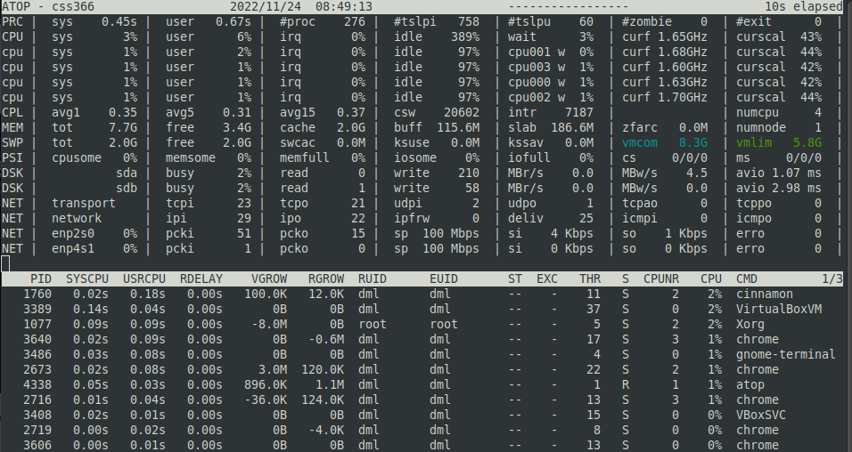

2. Сортировка по используемой памяти (shift + m)  
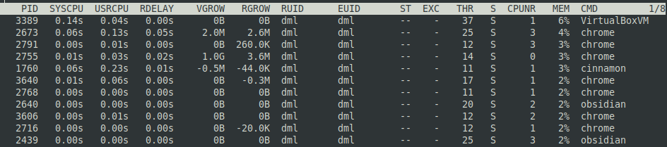

3. Сортировка по пользователям, root (shift + u --> root)  
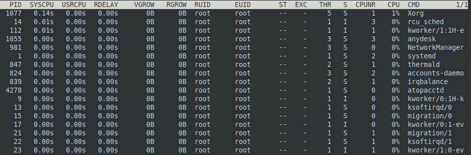

4. Загруженность дисков за 10 минут  


5. Загруженность RAM за 10 минут  
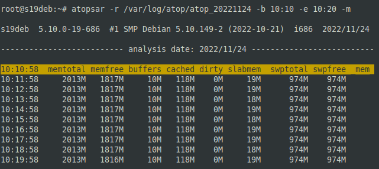

6. Делать снимок каждые полчаса  
```bash
nano /etc/default/atop --> LOGINTERVAL=1800
systemctl restart atop
```

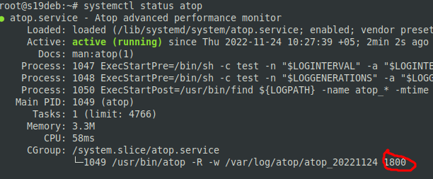

### Задание 3.
>При помощи команды mpstat и ключа P выведите информацию по:
>- определённому процессору;
>- всем процессорам.
>
>Приведите ответ в виде снимков экрана.

*Ответ:*  
```bash
sudo apt install sysstat
mpstat -P 3
mpstat -P ALL
```

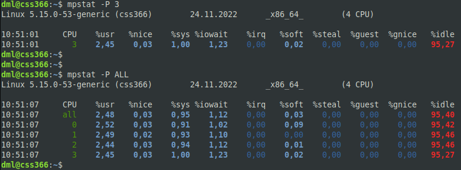

### Задание 4.
>Выполните проверку системы при помощи команды pidstat.
>1. Выведите статистику по эффективности на основе имени процесса.
>2. Выведите полный путь процесса.
>
>Приведите ответ в виде снимков экрана.

*Ответ:*  
```bash
pidstat -C VirtualBoxVM
pidstat -C VirtualBoxVM -l
```

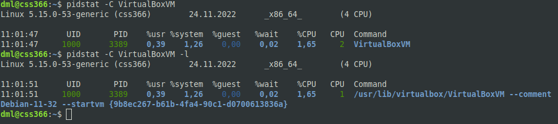

### Задание 5*.
>Просмотрите каталог /proc, выполните любую команду для просмотра процессов. Сделайте сравнение вывода команды и содержания папки по:
>- взаимосвязи объектов;
>- времени создания.
>
>Примечания: для просмотра времени создания, размера и прав на использования воспользуйтесь командой `ls -la`.  
>Приведите ответ в виде снимков экрана.

*Ответ:*  
Каталог `/proc` - виртуальная файловая система, которая обеспечивает связь с ядром. Предназначен для предоставления текущих параметров системы. `/proc` включает в себя файлы и каталоги с числовыми и символьными именами.  
Взаимосвязь - каталоги с числовыми именами содержат информацию о каждом выполняющемся процессе, имя каталога образовано идентификатором PID. При создании процесса соответствующий каталог появляется, а при уничтожении процесса - исчезает.  
На примере процесса 9769 (telegram-desktop):  
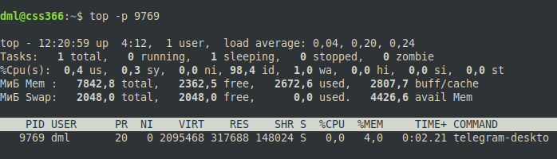

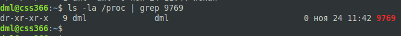

Время создания /proc/PID - время создания соответствующего процесса. При использовании утилит просмотра процессов в реальном времени (top) показано общее время центрального процессора, которое использовала задача с момента запуска.
