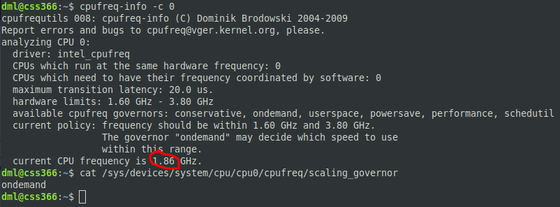

# 03.06. Производительность системы, ч.2 - Лебедев Д.С.
### Задание 1.
>Составьте задание через утилиту cron на проверку объема кэша-обновлений еженедельно. Кэш-обновлений - это обновления, которые остаются после выполнения `apt update`, `apt upgrade`.
>
>Приведите ответ в виде команды.

*Ответ:*  
Если именно одной командой (от root), то можно так:
```bash
echo "@weekly du -sh /var/cache/apt > /tmp/cash_update" | crontab
```


Команда выполняется каждый понедельник в 0 часов, 0 минут. Нужно иметь в виду, что при таком способе правки предыдущий crontab будет переписан.  
Можно добавить перед выводом в файл `/tmp/cash_update` объема кэша обновлений команды `apt update`, `apt upgrade` (и сначала обновить систему).    
Можно написать скрипт и вложить нужные команды в него.

### Задание 2.
>- Запустите процесс копирования большого файла (1 Гб) на жесткий диск.
>- Запустите команду `iostat`.
>- Запустите `iotop`. 
> 
>Какие процессы влияют на данные команды?  
>Проведите развернутый ответ и приложите снимки экрана.

*Ответ:*  

```bash
apt install sysstat
apt install iotop
...
dd if=/dev/sda1 of=/tmp/for_test bs=1 count=1000000000

iostat -hy /dev/sda1 3 5
iotop
```

Утилита `iostat` выводит основные параметры ввода и вывода данных на диск, скорость записи и чтения данных, а также количество записанных или прочитанных данных. Кроме того, утилита выводит параметры загруженности процессора. Её можно использовать для оптимизации работы системы.  
`iotop` покажет скорость чтения и записи на диск, а также процент использования файла подкачки каждым процессом.

Для дальнейшего сравнения запустим `iostat` без лишней загрузки:  


Запускаем копирование и пользуемся ioctat с параметром -y (с момента запуска утилиты):  


Обртив внимание на %system и %idle, делаем вывод о загруженности системы. Запустив iotop, можно убедиться что на показания влияет именно запущенный процесс копирования:  


### Задание 3.
>Настройте приоритет использования swap в пропорции:
>- 30/70;
>- 50/50;
>- 70/30.  
>
>Запустите браузер и нагрузите память.  
>Проанализируйте результат.  
>Проведите развернутый ответ и приложите снимки экрана.

*Ответ:*  

```bash
cat /proc/sys/vm/swappiness
...
sysctl vm.swappiness=30
sysctl -p
... или ...
echo 30 > /proc/sys/vm/swappiness
echo 50 > /proc/sys/vm/swappiness
echo 70 > /proc/sys/vm/swappiness
...
tail /dev/zero
vmstat 1 5
```

Для загрузки памяти используем команду `tail /dev/zero`, которая пытается прочесть последние строки файла, не имеющего конца.  
Первым сделан вывод vmstat в обычном режиме работы, без экстремальных нагрузок, swap не используется.


Вывод: Использование swap памяти системой [не является линейной величиной](https://habr.com/ru/post/540104/). Необходимость в использовании swap-файла возникает тогда, когда система не может удержать в памяти необходимый кэш и "грязные страницы". 


### Задание 4*.
>Задание можно выполнить, если вы используете Linux на реальном железе. Можно установить программу `apt install cpufreq` и посмотреть настройки режимов процессора.
>- Установите cpufreq;
>- Выполните настройку на режим сохранения энергии;
>- Выполните настройку полной производительности.  
>
>Сравните результаты.  
>Проведите развернутый ответ и приложите снимки экрана.

*Ответ:*  

```bash
apt install cpufrequtils
cpufreq-info
cat /sys/devices/system/cpu/cpu*/cpufreq/scaling_governor
...
cpufreq-info -c 0
sudo cpufreq-set -g powersave -c 0
sudo cpufreq-set -g performance -c 0
```

Далее работа с первым (0) ядром:
- Просмотр текущего значения параметра энергосбережения:  


Текущая частота ядра - 1,86

- Применяем режим энергосбережения. Текущая частота упала до 1,64:  


- Применяем режим повышенной энергоэффективности, текущая частота выросла до 2,04 ГГц:   
